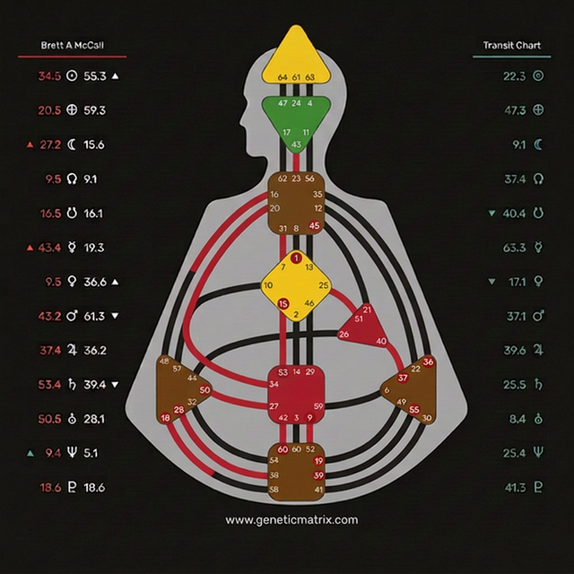

# Bodygraph UI Reference

The layout and styling of the Bodygraph component mimics the standard HD layout. 

## Geometry & Layout
The exact layout and center mapping coordinates are documented in the `bodygraph_layout_reference.png` attached below:

This mockup demonstrates the expected offset placement of gates inside the centers.
